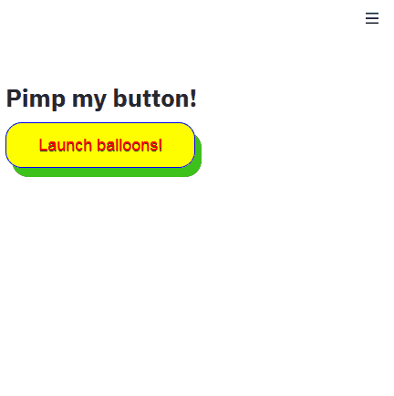

# Streamlit CSS Button

[](https://share.streamlit.io/andfanilo/streamlit-css-button/example/app.py)

Pimp your button with CSS!



## Install

```
pip install streamlit-css-button
```

## Usage

See `example/app.py` for a more complete example.

The gif example is made with the following code:

```python
import streamlit as st
from streamlit_css_button import css_properties
from streamlit_css_button import st_css_button

st.title("Pimp my button!")

if st_css_button(
    "Launch balloons!",
    css_properties=css_properties(
        height="50px",
        width="200px",
        color="red",
        backgroundColor="yellow",
        border="1px solid blue",
        borderRadius="1em",
        cursor="pointer",
        fontFamily="Arial",
        fontSize="18px",
        padding="6px 13px",
        margin="0 0 12px 0",
        textDecoration="none",
        boxShadow="7px 10px 0px 0px #3dc21b",
        textShadow="0px 1px 0px #2f6627",
        transition="width 2s, height 2s, transform 2s",
    ),
    hover_properties=css_properties(
        backgroundImage="linear-gradient(to bottom, #3498db, #2980b9)",
        fontWeight="bold",
        width="300px",
    ),
    active_properties=css_properties(backgroundColor="green",),
):
    st.balloons()
```

## Development

### Install

- JS side

```shell script
cd frontend
npm install
```

- Python side

```shell script
conda create -n streamlit-css-button python=3.7
conda activate streamlit-css-button
pip install -e .
```

### Run

Both webpack dev server and Streamlit need to run for development mode.

- JS side

```shell script
cd frontend
npm run dev
```

- Python side

```shell script
streamlit run app.py
```

## Why this package?

- There are several people who want to pimp their Streamlit button.
- I wanted to try [Parcel](https://parceljs.org/) to build the smallest component codebase. It comes with native Typescript support.
- It's also a good time to try CSS-in-JS. [JSS](https://cssinjs.org/) seemed super easy to setup in vanilla Typescript.

## References

# Support me

<a href="https://www.buymeacoffee.com/andfanilo" target="_blank"></a>
